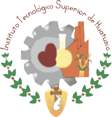

# Sistema de Justificantes ITSH

## Descripción

Este sistema permitirá a los alumnos enviar solicitudes y tener sus justificantes. Los jefes de carrera podrán revisar y administrar a los alumnos dentro del sistema, y los administradores podrán administrar a otros administradores o jefes de carrera dentro del sistema.

## Tecnologías

- PHP
- MySQL
- HTML
- CSS
- JS
